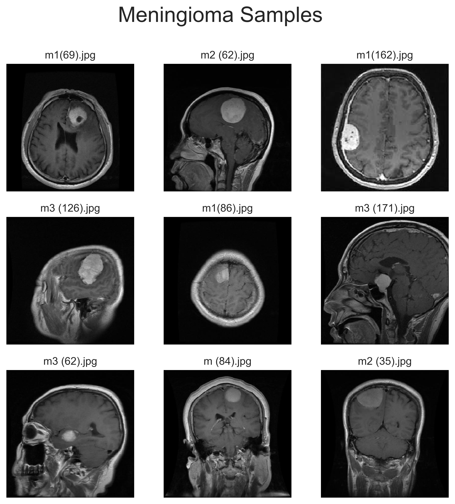
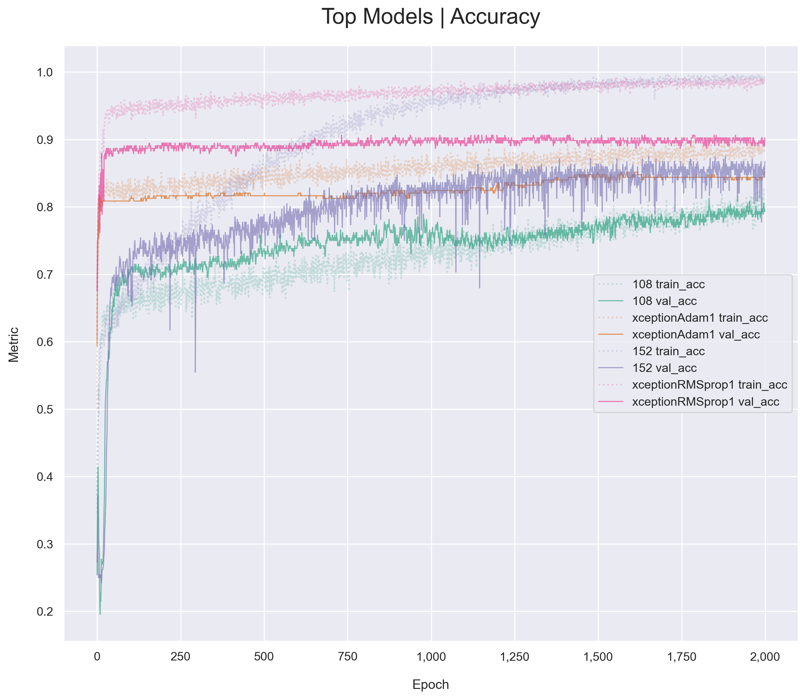
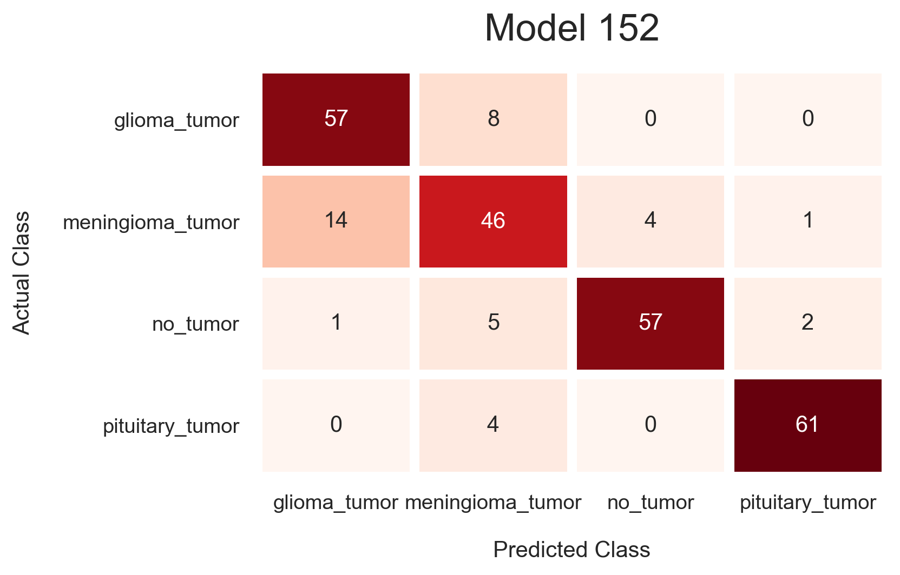
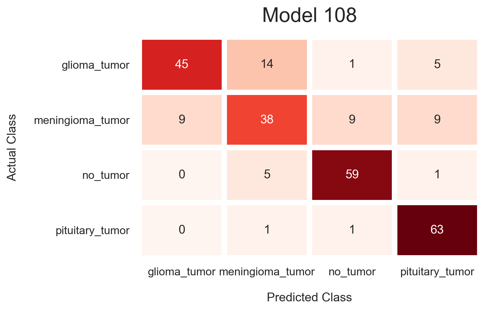
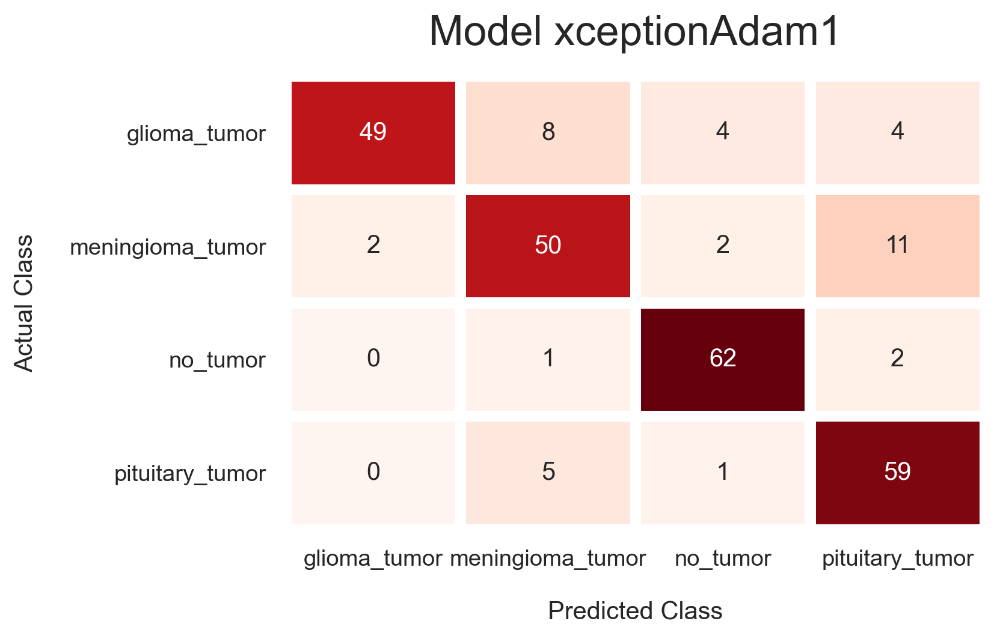
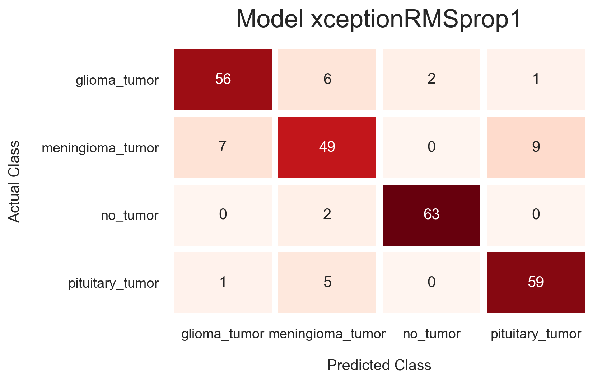

<h1 style='text-align: center'> Brain Tumor Classification </h1>

This is a small project to introduce the problem of *classifying brain tumors in MRIs*.  The dataset is pulled from Kaggle and was flagged with a usability score of 5/10 so it wasn't ideal, and it became evident when reviewing the results that duplicates existed and images were misclassified.  Nonetheless, it was useful for this exercise.

The notebooks are split into logical steps, starting with the image preprocessing, followed by a grid search of simple hyperparameters including layer counts (this projects explores fairly shallow models consisting of no more than 5 hidden layers), followed by a notebook implementing a transfer learning approach.

CNNs are built and trained from scratch in the second notebook.  A pretrained Xception base is utilized in the second notebook for a quick baseline with which to compare the shallow CNNs performances.  The transfer learning model's convolutional base is held frozen in this notebook to expediate comparisons.

Further research would include deeper custom CNNs to train from scratch (the transfer learning model's base has 16 layers) as well as training the transfer learning model's convolutional base weights.

*The main results from these notebooks can be viewed below.  Plots of model structures can be found in images along with classification reports.*
 

